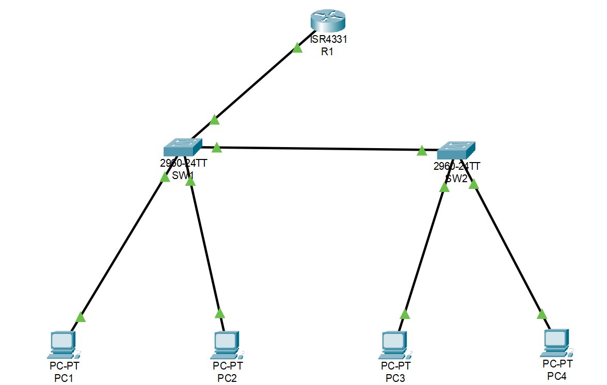
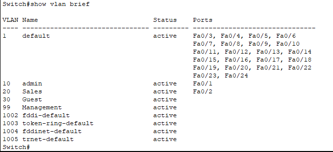
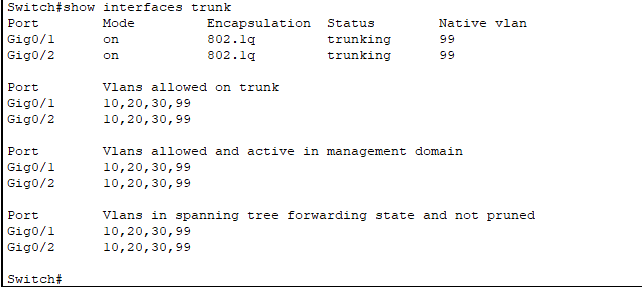
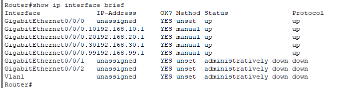
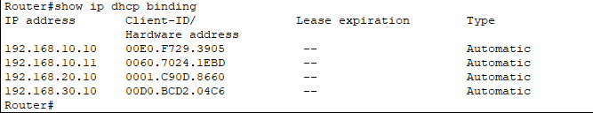
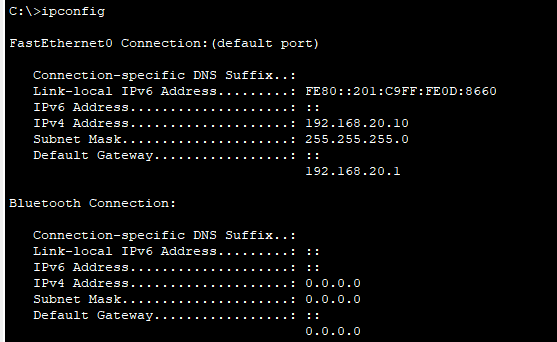
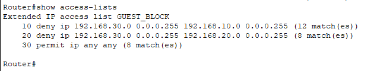
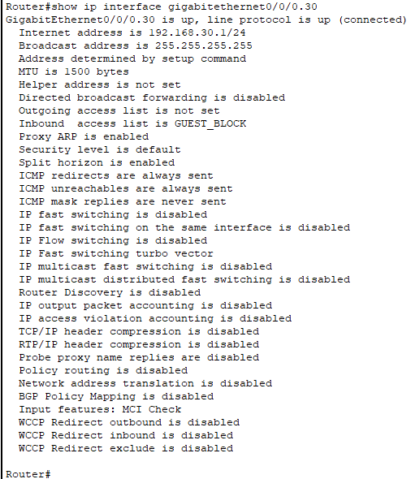
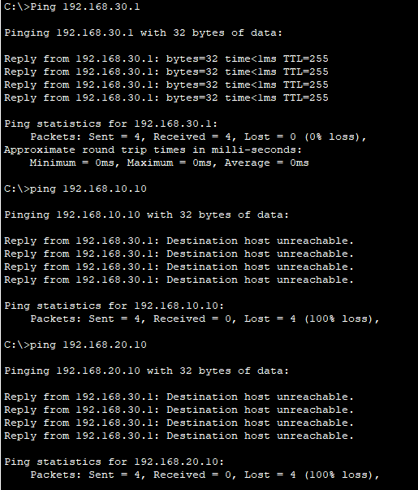
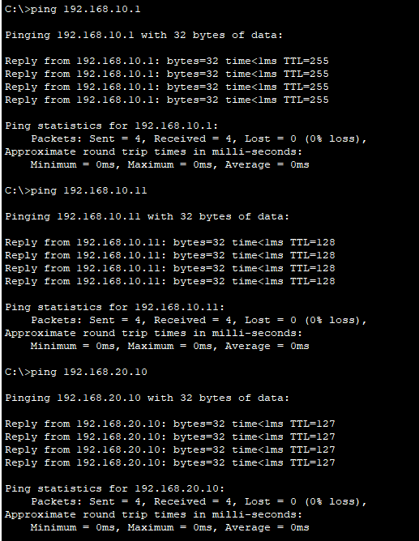

# CCNA Network Lab: VLANs, Inter-VLAN Routing, ACLs, and DHCP

## Project Overview

This home lab simulates a small enterprise network using Cisco Packet Tracer. The lab was built to practice core network technician skills including VLAN configuration, trunking, router-on-a-stick inter-VLAN routing, DHCP, and ACL-based traffic segmentation.

The network was designed with separate departments and a guest network to demonstrate both normal connectivity and restricted access policies. I also validated both working and failure scenarios to make the lab closer to real troubleshooting tasks.

## Objectives

- Create and assign VLANs for different departments
- Configure trunk links between switches and the router
- Enable inter-VLAN routing using router-on-a-stick
- Provide DHCP services for each VLAN
- Apply ACLs to isolate guest traffic from internal networks
- Validate connectivity and blocked traffic with ping testing
- Build a repeatable troubleshooting checklist

## Topology

## Network Design

### VLANs

- **VLAN 10** - Admin
- **VLAN 20** - Sales
- **VLAN 30** - Guest
- **VLAN 99** - Management / Native VLAN

### Device Roles

- **R1** - Router-on-a-stick gateway and DHCP server
- **SW1** - Primary switch connected to the router
- **SW2** - Secondary access switch connected by trunk link
- **PC1 / PC3** - Admin VLAN devices
- **PC2** - Sales VLAN device
- **PC4** - Guest VLAN device

### IP Addressing

- **VLAN 10**: `192.168.10.0/24`
- **VLAN 20**: `192.168.20.0/24`
- **VLAN 30**: `192.168.30.0/24`
- **VLAN 99**: `192.168.99.0/24`

### Default Gateways

- **VLAN 10**: `192.168.10.1`
- **VLAN 20**: `192.168.20.1`
- **VLAN 30**: `192.168.30.1`
- **VLAN 99**: `192.168.99.1`

## VLAN Configuration

VLANs were created on the switches and access ports were assigned based on department.

- **PC1** on SW1 -> VLAN 10
- **PC2** on SW1 -> VLAN 20
- **PC3** on SW2 -> VLAN 10
- **PC4** on SW2 -> VLAN 30

## Trunk Configuration

Trunk links were configured between:

- **SW1 and R1**
- **SW1 and SW2**

Allowed VLANs on the trunks:

- `10,20,30,99`

Native VLAN:

- `99`

## Inter-VLAN Routing

Router-on-a-stick was configured on R1 using subinterfaces for each VLAN:

- `G0/0/0.10` -> VLAN 10 gateway
- `G0/0/0.20` -> VLAN 20 gateway
- `G0/0/0.30` -> VLAN 30 gateway
- `G0/0/0.99` -> VLAN 99 native gateway

This allowed communication between internal VLANs while still supporting segmentation through ACLs.

## DHCP Configuration

R1 was also configured as the DHCP server for VLAN 10, VLAN 20, and VLAN 30. Excluded addresses were reserved for gateway and low-end static assignment space.

DHCP bindings confirmed that clients in multiple VLANs successfully received addresses from the correct subnet.

Example client lease:

## ACL-Based Segmentation

An extended ACL named **GUEST_BLOCK** was applied inbound on the Guest VLAN subinterface to prevent Guest VLAN traffic from reaching internal networks.

### ACL policy

- Deny Guest VLAN -> Admin VLAN
- Deny Guest VLAN -> Sales VLAN
- Permit other traffic

ACL applied on Guest VLAN interface:

## Validation Tests

### Successful connectivity tests

The lab successfully demonstrated:

- PC to default gateway communication
- Same-VLAN communication across switches
- Inter-VLAN communication between Admin and Sales

### Blocked guest access tests

The Guest VLAN could still reach its own default gateway, but could not reach internal VLAN hosts. This confirmed ACL-based segmentation was working as intended.

## Troubleshooting Checklist

### 1. VLAN mismatch
If a PC cannot reach devices in the same VLAN:

- Run `show vlan brief`
- Confirm the switch port is assigned to the correct VLAN
- Verify the cable is connected to the expected access port

### 2. Trunk issue
If traffic fails across switches or inter-VLAN routing does not work:

- Run `show interfaces trunk`
- Verify the trunk is up
- Check allowed VLANs
- Confirm the native VLAN matches on both sides

### 3. Router-on-a-stick issue
If same-VLAN traffic works but cross-VLAN traffic fails:

- Run `show ip interface brief`
- Confirm the physical router interface is up
- Verify each subinterface uses the correct `encapsulation dot1Q`
- Verify each subinterface has the right gateway IP

### 4. DHCP issue
If a client does not get an IP address:

- Confirm the client is set to DHCP
- Run `show ip dhcp pool`
- Run `show ip dhcp binding`
- Verify the DHCP pool matches the VLAN subnet and default gateway

### 5. ACL issue
If traffic is blocked when it should work, or allowed when it should fail:

- Run `show access-lists`
- Verify rule order
- Confirm source and destination networks are correct
- Check where the ACL is applied and in which direction

### 6. Wrong test target
A failed ping may be caused by testing an old static IP instead of the current DHCP lease. Always confirm the current address first with `ipconfig`.

## Skills Demonstrated

- VLAN creation and access port assignment
- Trunk configuration
- Router-on-a-stick inter-VLAN routing
- DHCP pool configuration and lease validation
- Extended ACL configuration
- Connectivity testing and failure validation
- Basic network troubleshooting and documentation

## Files Included

- `CCNA Network lab.pkt` - Packet Tracer lab file
- `01-topology.png`
- `02-vlans.png`
- `03-trunks.png`
- `04-router-subinterfaces.png`
- `05-dhcp-bindings.png`
- `06-acl-rules.png`
- `07-acl-applied-interface.png`
- `08-dhcp-client-ipconfig.png`
- `09-success-ping-tests.png`
- `10-guest-vlan-blocked.png`

## Summary

This lab helped me practice the kind of configuration and troubleshooting tasks commonly seen in network support and network technician roles. It also gave me hands-on experience validating both successful traffic flow and restricted access using segmentation controls.
